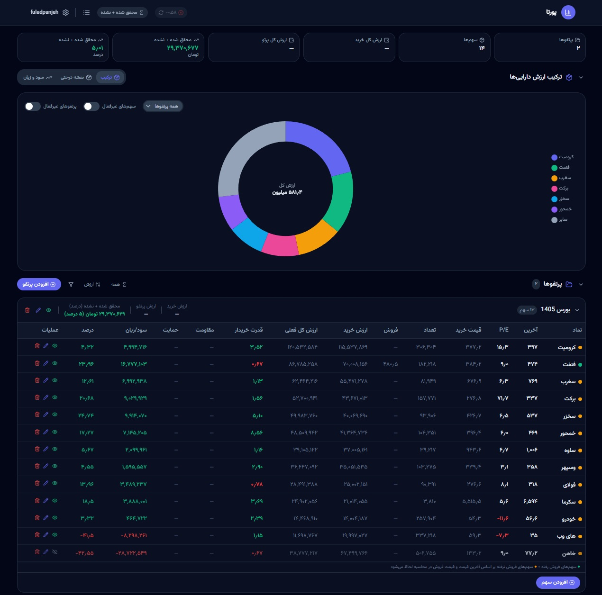

<p align="center">
  
</p>

<h1 align="center">پورتا | Porta</h1>

<p align="center">
  پورتفولیوی هوشمند سهام بورس ایران
</p>

<p align="center">
  <a href="#ویژگی‌ها">ویژگی‌ها</a> •
  <a href="#دانلود">دانلود</a> •
  <a href="#نصب-سریع">نصب سریع</a> •
  <a href="#ساخت-و-توسعه">توسعه</a> •
  <a href="#ساختار-پروژه">ساختار</a>
</p>

---

<p align="center">
  یک داشبورد حرفه‌ای RTL برای مدیریت پورتفولیوی سهام بورس ایران.
  محاسبه سود و زیان، سطوح مقاومت و حمایت، نمودار قیمت و بسیاری امکانات دیگر.
</p>

<p align="center">
  
</p>

<p align="center">
  
  
  
  
  
</p>

---

## ویژگی‌ها

- مدیریت چند پورتفولیو با نام‌های دلخواه
- اضافه/ویرایش/حذف سهام در هر پورتفولیو
- محاسبه خودکار سود و زیان (با احتساب کارمزد)
- درصد سود/زیان نسبت به قیمت خرید
- نمودار قیمت با سطوح مقاومت و حمایت
- بروزرسانی خودکار قیمت از وب‌سرویس بورس (BRS API)
- جستجوی نمادها در بازار بورس ایران
- نمایش KPIهای پورتفولیو (ارزش کل، سود/زیان، درصد تغییر)
- حالت تاریک و روشن
- پشتیبانی کامل RTL و زبان فارسی
- طراحی ریسپانسیو (موبایل، تبلت، دسکتاپ)
- واحد پول ریال/تومان
- کارمزد خرید/فروش قابل تنظیم

## دانلود

### آماده استقرار (برای هاست cPanel)

1. به صفحه [Release ها](https://github.com/fuladpanje/porta/releases) بروید
2. آخرین Release را پیدا کنید و فایل **porta-deploy.zip** را دانلود کنید
3. فایل ZIP را از حالت فشرده خارج کنید. محتوای پوشه `deploy/` آماده است.
4. فایل `deploy/backend/.env` رو باز کن و `APP_URL` و `SANCTUM_STATEFUL_DOMAINS` رو به دامنه خودت عوض کن. همچنین `DB_DATABASE`، `DB_USERNAME`، `DB_PASSWORD` رو پر کن.

## نصب روی هاست cPanel

> بدون نیاز به SSH!

فایل‌های داخل پوشه `deploy/` رو آپلود کن به `public_html/` سایتت:

```
public_html/
├── backend/
│   ├── public/   ← نقطه ورود Laravel
│   └── ...
└── database.sql  ← ایمپورت توی phpMyAdmin
```

سپس:

1. توی **phpMyAdmin** فایل `database.sql` رو ایمپورت کن
2. **Document Root** رو عوض کن به `backend/public` (راهنمای مسیر دقیق):

   **دامنه اصلی** (مثلاً `example.com`):
   ```
   public_html/example.com/backend/public
   ```

   **ساب‌دامنه** (مثلاً `sub.example.com`):
   ```
   public_html/sub.example.com/backend/public
   ```

   یا ساده‌تر: هر مکانی که پوشه `backend/` آپلود شده، مسیرش رو اضافه کن `backend/public`. در cPanel فرم مستقیم بنویس.
3. پرمیشن `storage/` و `bootstrap/cache/` رو بذار `755`
4. فایل `.env` رو ویرایش کن (پیش‌فرض در `deploy/backend/.env`). دو تا چیز عوض کن:

   **اول:** اطلاعات دیتابیس (فقط این سه تا):
   ```env
   DB_DATABASE=نام_دیتابیس_توی_cPanel
   DB_USERNAME=نام_کاربر_dیتابیس
   DB_PASSWORD=رمز_دیتابیس
   ```

   **دوم:** نام دامنه خودت رو تغییر بده. این دو خط رو پیدا کن و عوض کن:
   ```env
   APP_URL=https://example.com
   SANCTUM_STATEFUL_DOMAINS=example.com
   ```
   اطلاعات دیتابیس رو از بخش **MySQL Databases** توی cPanel پیدا می‌کنی. بقیه فیلدها رو دست نزن.

5. تست کن 🎉

---

## دستورات مفید

```bash
# بیلد فرانت‌اند برای پروداکشن
cd frontend
npm run build

# حذف کش
cd backend
php artisan cache:clear
php artisan config:clear
php artisan route:clear

# مایگریشن
cd backend
php artisan migrate
php artisan migrate:fresh --seed   # با داده تستی
```

## ساخت فایل deploy و Release

```bash
# ویندوز
.\deploy.ps1

# لینوکس/Mac
chmod +x install.sh
./install.sh
```

سپس فایل‌های داخل پوشه `deploy/` رو ZIP کن با نام `porta-deploy.zip` و در صفحه [Releases](https://github.com/fuladpanje/porta/releases) یک Release جدید بسازید. `porta-deploy.zip` رو به عنوان Asset ضمیم کن.

## ساختار پروژه

```
porta/
├── backend/                    # Laravel 11 API
│   ├── app/
│   │   ├── Http/Controllers/
│   │   │   ├── Auth/           # AuthController
│   │   │   ├── PortfolioController.php
│   │   │   ├── PortfolioItemController.php
│   │   │   ├── StockController.php
│   │   │   └── ApiKeyController.php
│   │   └── Models/
│   │       ├── User.php
│   │       ├── Portfolio.php
│   │       ├── PortfolioItem.php
│   │       └── ApiKey.php
│   ├── config/
│   ├── database/migrations/    # 13 migration
│   ├── routes/api.php          # مسیرهای API
│   └── public/                 # نقطه ورود Laravel + فرانت‌اند
│
├── frontend/                   # React + Vite + Tailwind
│   ├── src/
│   │   ├── components/
│   │   │   ├── Header.jsx
│   │   │   ├── Layout.jsx
│   │   │   ├── ThemeProvider.jsx
│   │   │   └── SymbolSearch.jsx
│   │   ├── pages/
│   │   │   ├── Login.jsx
│   │   │   ├── Register.jsx
│   │   │   ├── Dashboard.jsx
│   │   │   ├── Settings.jsx
│   │   │   └── AllSymbols.jsx
│   │   ├── hooks/
│   │   │   ├── useAuth.jsx
│   │   │   └── usePortfolio.jsx
│   │   ├── contexts/
│   │   │   └── UnitContext.jsx
│   │   └── lib/
│   │       ├── api.js
│   │       ├── calculations.js
│   │       └── symbolCache.js
│   ├── public/favicon.svg
│   └── dist/                   # خروجی بیلد
│
├── deploy.bat                  # اسکریپت deploy ویندوز
├── deploy.ps1                  # اسکریپت deploy PowerShell
├── database.sql                # فایل SQL برای ایمپورت دیتابیس
├── install.sh                  # اسکریپت deploy لینوکس
├── porta-scr.jpg               # اسکرین‌شات سایت
├── porta-deploy.zip            # بسته آماده استقرار
├── setup.bat                   # راه‌اندازی محلی ویندوز
└── .env.example                # متغیرهای محیطی نمونه
```

## API

| مسیر | متد | توضیح |
|------|-----|-------|
| `/api/register` | POST | ثبت‌نام |
| `/api/login` | POST | ورود |
| `/api/logout` | POST | خروج (نیاز به auth) |
| `/api/user` | GET | اطلاعات کاربر |
| `/api/portfolios` | GET/POST | لیست/ساخت پورتفولیو |
| `/api/portfolios/{id}` | GET/PUT/DELETE | مدیریت پورتفولیو |
| `/api/dashboard` | GET | داده داشبورد |
| `/api/portfolios/{id}/items` | GET/POST | آیتم‌های پورتفولیو |
| `/api/stocks/refresh` | POST | بروزرسانی قیمت‌ها |
| `/api/stocks/symbols?q=` | GET | جستجوی نماد |
| `/api/api-keys` | GET/POST | مدیریت کلیدهای API |

## دریافت API Key از BRS

برای استفاده از قابلیت بروزرسانی خودکار قیمت‌ها، باید API Key از سایت [brsapi.ir](https://brsapi.ir) دریافت کنید:

1. به سایت [brsapi.ir](https://brsapi.ir) بروید
2. ثبت‌نام کنید
3. به بخش **پنل کاربری** بروید
4. API Key خود را کپی کنید
5. در پنل مدیریت پورتا به مسیر **Settings → API Keys** بروید
6. کلید را اضافه کنید و فعال کنید

## تکنولوژی‌ها

| لایه | تکنولوژی | نسخه |
|------|----------|------|
| Backend | Laravel | 11 |
| Auth | Laravel Sanctum | 4 |
| Frontend | React | 18 |
| Build | Vite | 6 |
| CSS | Tailwind CSS | 3 |
| Charts | Chart.js | 4 |
| Icon | Lucide React | 0.460 |
| Font | Vazirmatn | 5 |

## لایسنس

MIT License

---

<p align="center">
  ساخته شده با ❤️ برای سرمایه‌گذاران بازار بورس ایران
</p>