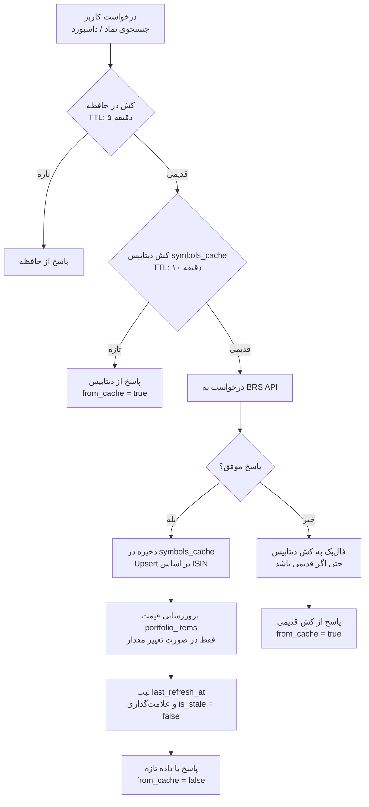
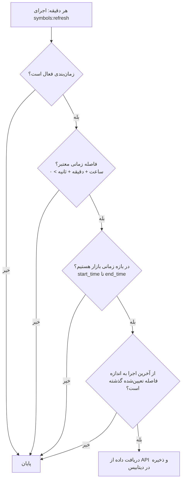
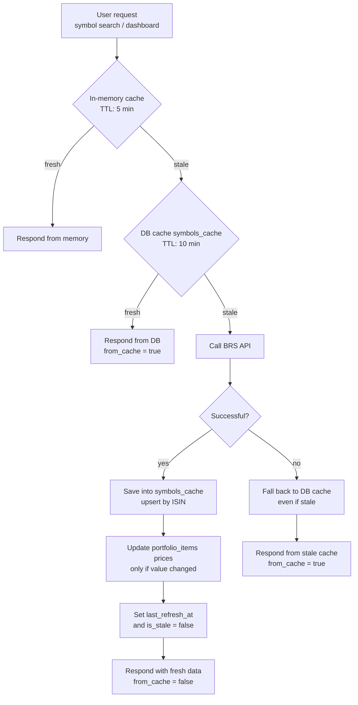
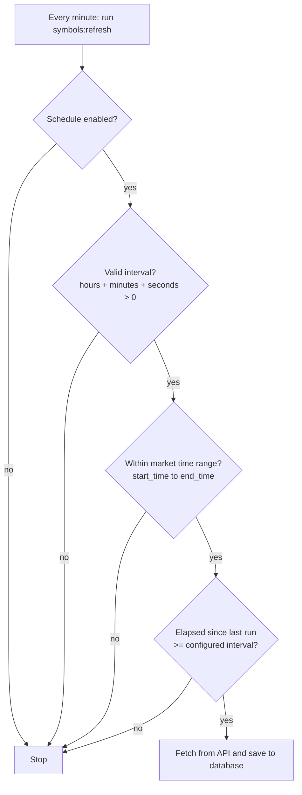

<p align="center">
  
</p>

<h1 align="center">پورتا | Porta</h1>

<p align="center">
  <a href="#نسخه-فارسی">🇮🇷 فارسی</a> •
  <a href="#english-version">🇺🇸 English</a>
</p>

<p align="center">
  
  
  
  
  
</p>

<p align="center">
  
</p>

---

<a id="نسخه-فارسی"></a>

# 🇮🇷 نسخه فارسی

<p align="center">
  یک داشبورد حرفه‌ای RTL برای مدیریت پورتفولیوی سهام بورس ایران
</p>

## ویژگی‌ها

- مدیریت چند پورتفولیو با نام‌های دلخواه
- اضافه/ویرایش/حذف سهام در هر پورتفولیو
- محاسبه خودکار سود و زیان (با احتساب کارمزد)
- درصد سود/زیان نسبت به قیمت خرید
- نمودار قیمت با سطوح مقاومت و حمایت
- بروزرسانی خودکار قیمت از وب‌سرویس بورس (BRS API)
- جستجوی نمادها در بازار بورس ایران
- نمایش KPIهای پورتفولیو (ارزش کل، سود/زیان، درصد تغییر)
- حالت تاریک و روشن
- پشتیبانی کامل RTL و زبان فارسی
- طراحی ریسپانسیو (موبایل، تبلت، دسکتاپ)
- واحد پول ریال/تومان
- کارمزد خرید/فروش قابل تنظیم

## دانلود

1. به صفحه [Release‌ها](https://github.com/fuladpanje/porta/releases) بروید
2. آخرین Release را پیدا کنید و فایل **porta-deploy.zip** را دانلود کنید
3. فایل ZIP را از حالت فشرده خارج کنید و محتوایش را به `public_html/` سایت خود آپلود کنید

## نصب روی هاست cPanel

> بدون نیاز به SSH!

فایل‌های داخل پوشه `deploy/` را به `public_html/` آپلود کنید:

```
public_html/
├── backend/
│   ├── public/   ← نقطه ورود Laravel
│   └── ...
└── database.sql  ← ایمپورت در phpMyAdmin
```

1. در cPanel یک دیتابیس بسازید و یک کاربر به آن اختصاص دهید
2. در phpMyAdmin، دیتابیس را انتخاب کرده و `database.sql` را ایمپورت کنید
3. Document Root را به `backend/public` تغییر دهید
4. سطح دسترسی `storage/` و `bootstrap/cache/` را `755` قرار دهید
5. فایل `.env` را ویرایش کنید:

```env
DB_DATABASE=نام_دیتابیس
DB_USERNAME=نام_کاربر
DB_PASSWORD=رمز_عبور
APP_URL=https://example.com
SANCTUM_STATEFUL_DOMAINS=example.com
```

6. تست کنید

## تنظیم بروزرسانی خودکار (Cron Job)

بروزرسانی خودکار قیمت نمادها از طریق **Cron Job** در cPanel انجام می‌شود.

### تنظیم در cPanel

1. وارد **cPanel** شوید
2. بخش **Advanced** > **Cron Jobs** را باز کنید
3. یک Cron Job جدید با تنظیمات زیر اضافه کنید:

| فیلد | مقدار |
|------|-------|
| Minute | `*` |
| Hour | `*` |
| Day | `*` |
| Month | `*` |
| Weekday | `*` |

4. در فیلد **Command** وارد کنید:

```bash
cd /home/YOUR_USERNAME/public_html/example.com/backend && php artisan schedule:run >> /dev/null 2>&1
```

> مسیر بالا را بر اساس مسیر نصب ساب‌دومین خودتان تنظیم کنید. مسیر دقیق را از بخش **Subdomains** در cPanel پیدا کنید.

### نقش ادمین

اولین کاربری که در سایت عضو شود، به صورت خودکار **ادمین** می‌شود. ادمین می‌تواند:

- **کلیدهای API** را اضافه، ویرایش و حذف کند
- **زمان‌بندی بروزرسانی خودکار** (ثانیه، دقیقه، ساعت) را تنظیم کند
- **بازه زمانی اجرا** (ساعت شروع و پایان) را مشخص کند

برای دسترسی به تنظیمات ادمین، از منوی **تنظیمات ادمین** استفاده کنید.

## API

| Method | Endpoint | توضیح |
|--------|----------|-------|
| POST | `/api/register` | ثبت‌نام |
| POST | `/api/login` | ورود |
| POST | `/api/logout` | خروج |
| GET | `/api/user` | اطلاعات کاربر |
| PUT | `/api/user/unit` | تغییر واحد پول |
| PUT | `/api/user/auto-switch` | سوییچ خودکار |
| PUT | `/api/user/schedule` | زمان‌بندی |
| PUT | `/api/user/fee-settings` | تنظیم کارمزد |
| GET/POST | `/api/portfolios` | لیست/ساخت پورتفولیو |
| GET/PUT/DELETE | `/api/portfolios/{id}` | مدیریت پورتفولیو |
| GET/POST | `/api/portfolios/{id}/items` | آیتم‌ها |
| PUT/DELETE | `/api/portfolios/{id}/items/{itemId}` | مدیریت سهم |
| GET | `/api/dashboard` | داشبورد |
| PUT | `/api/portfolios/{id}/fee-settings` | کارمزد اختصاصی |
| PUT | `/api/portfolios/{id}/toggle-active` | فعال/غیرفعال |
| POST | `/api/stocks/refresh` | بروزرسانی قیمت |
| GET | `/api/stocks/symbols?q=` | جستجوی نماد |
| GET/POST | `/api/admin/api-keys` | کلیدهای API (ادمین) |
| PUT/DELETE | `/api/admin/api-keys/{id}` | ویرایش/حذف کلید (ادمین) |
| PUT | `/api/admin/schedule` | زمان‌بندی (ادمین) |
| POST | `/api/admin/refresh-symbols` | بروزرسانی دستی نمادها |

## ساختار دیتابیس

### جدول `users`

| ستون | نوع | پیش‌فرض | توضیح |
|------|------|---------|-------|
| `id` | bigint (PK) | — | شناسه |
| `username` | string (unique) | — | نام کاربری |
| `email` | string (unique) | — | ایمیل |
| `password` | string | — | رمز عبور |
| `is_admin` | boolean | `false` | آیا ادمین است |
| `is_stale` | boolean | `true` | داده قدیمی است |
| `unit` | string(10) | `rial` | واحد پول (rial/toman) |
| `auto_switch` | boolean | `true` | سوییچ خودکار API |
| `schedule_enabled` | boolean | `false` | فعال‌سازی زمان‌بندی |
| `schedule_seconds` | integer | `0` | ثانیه زمان‌بندی |
| `schedule_minutes` | integer | `5` | دقیقه زمان‌بندی |
| `schedule_hours` | integer | `0` | ساعت زمان‌بندی |
| `commission_enabled` | boolean | `false` | فعال‌سازی کارمزد |
| `buy_commission` | decimal(5,2) | `0.37` | کارمزد خرید (%) |
| `sell_commission` | decimal(5,2) | `0.88` | کارمزد فروش (%) |
| `email_verified_at` | timestamp | `null` | زمان تأیید ایمیل |
| `remember_token` | string | — | توکن مرا به خاطر بسپار |
| `created_at` / `updated_at` | timestamp | — | زمان ایجاد/ویرایش |

### جدول `portfolios`

| ستون | نوع | پیش‌فرض | توضیح |
|------|------|---------|-------|
| `id` | bigint (PK) | — | شناسه |
| `user_id` | bigint (FK) | — | مالک (حذف Cascade) |
| `name` | string | — | نام پورتفولیو |
| `commission_enabled` | boolean | `false` | کارمزد اختصاصی |
| `buy_commission` | decimal(5,2) | `0.37` | کارمزد خرید اختصاصی |
| `sell_commission` | decimal(5,2) | `0.88` | کارمزد فروش اختصاصی |
| `active` | boolean | `true` | فعال/غیرفعال |
| `created_at` / `updated_at` | timestamp | — | زمان ایجاد/ویرایش |

### جدول `portfolio_items`

| ستون | نوع | پیش‌فرض | توضیح |
|------|------|---------|-------|
| `id` | bigint (PK) | — | شناسه |
| `portfolio_id` | bigint (FK) | — | مالک (حذف Cascade) |
| `symbol` | string | — | نماد بورسی |
| `last_price` | decimal(12,2) | `null` | آخرین قیمت |
| `pe` | decimal(12,2) | `null` | نسبت P/E |
| `buy_price` | decimal(12,2) | — | قیمت خرید |
| `quantity` | decimal(12,4) | — | تعداد سهم |
| `sell_price` | decimal(12,2) | `null` | قیمت فروش |
| `resistance_1/2/3` | decimal(12,2) | `null` | سطوح مقاومت |
| `support_1/2/3` | decimal(12,2) | `null` | سطوح حمایت |
| `active` | boolean | `true` | فعال/غیرفعال |
| `created_at` / `updated_at` | timestamp | — | زمان ایجاد/ویرایش |

### جدول `api_keys`

| ستون | نوع | پیش‌فرض | توضیح |
|------|------|---------|-------|
| `id` | bigint (PK) | — | شناسه |
| `user_id` | bigint (FK) | — | مالک (حذف Cascade) |
| `name` | string | — | نام کلید |
| `api_key` | text | — | کلید API |
| `is_default` | boolean | `false` | کلید پیش‌فرض |
| `daily_requests` | integer | `0` | درخواست‌های روزانه |
| `last_reset_at` | timestamp | `null` | آخرین ریست شمارنده |
| `created_at` / `updated_at` | timestamp | — | زمان ایجاد/ویرایش |

### جدول `favorites`

| ستون | نوع | پیش‌فرض | توضیح |
|------|------|---------|-------|
| `id` | bigint (PK) | — | شناسه |
| `user_id` | bigint (FK) | — | مالک (حذف Cascade) |
| `symbol` | string | — | نماد مورد علاقه |
| `created_at` / `updated_at` | timestamp | — | زمان ایجاد/ویرایش |

> Unique: (`user_id`, `symbol`)

### جدول `symbols_cache`

| ستون | نوع | پیش‌فرض | توضیح |
|------|------|---------|-------|
| `id` | bigint (PK) | — | شناسه |
| `isin` | string(50) (unique) | — | کد ISIN نماد |
| `symbol` | string | — | نماد |
| `full_name` | string | — | نام کامل |
| `last_price` | decimal(12,2) | `null` | آخرین قیمت |
| `pe` | decimal(12,2) | `null` | نسبت P/E |
| `price_change_percent` | decimal(8,2) | `null` | درصد تغییر قیمت |
| `price_change` | decimal(12,2) | `null` | مبلغ تغییر قیمت |
| `sector` | string | `null` | صنعت |
| `last_updated_at` | timestamp | `null` | آخرین بروزرسانی |

### جدول `system_settings`

| ستون | نوع | پیش‌فرض | توضیح |
|------|------|---------|-------|
| `id` | bigint (PK) | — | شناسه |
| `setting_key` | string(100) (unique) | — | کلید تنظیم |
| `setting_value` | text | `null` | مقدار تنظیم |
| `description` | string(255) | `null` | توضیحات |
| `created_at` / `updated_at` | timestamp | — | زمان ایجاد/ویرایش |

---

## بروزرسانی داده‌ها و کش

داده‌های قیمت سهام از وب‌سرویس **BRS API** (بورس تهران) دریافت و در دیتابیس کش می‌شود تا هم سرعت پاسخ افزایش یابد و هم تعداد درخواست‌های ارسالی به API به حداقل برسد. در این بخش معماری بروزرسانی داده‌ها، ذخیره‌سازی، کش و رفرش خودکار توضیح داده می‌شود.

### نمای کلی جریان داده



### منبع داده

- **اندپوینت**: `https://Api.BrsApi.ir/Tsetmc/AllSymbols.php?key={API_KEY}`
- خروجی شامل اطلاعات کامل همه نمادهای بازار بورس ایران است: کد ISIN، نام کوتاه/کامل، آخرین قیمت، نسبت P/E، درصد و مبلغ تغییر قیمت، صنعت و آمار سفارش‌ها.

### ذخیره‌سازی در دیتابیس

| جدول | نقش |
|------|-----|
| `symbols_cache` | کش کامل همه نمادها؛ کلید یکتای `isin` و بروزرسانی با `upsert` |
| `portfolio_items` | اعمال آخرین قیمت، P/E و آمار سفارش‌ها روی سهام هر پورتفولیو |
| `system_settings` | تنظیمات و ابرداده (کلیدهای API، زمان‌بندی، `last_refresh_at`) |

> نکته: در `portfolio_items` مقدار یک فیلد فقط در صورتی آپدیت می‌شود که نسبت به مقدار قبلی تغییر کرده باشد تا تعداد رکوردهای تغییر یافته و ترافیک دیتابیس به حداقل برسد.

### استفاده از کش دیتابیس

- وقتی کش دیتابیس «تازه» است (بر اساس `symbols_cache_age_minutes` که پیش‌فرض ۱۰ دقیقه است)، درخواست‌ها مستقیماً از دیتابیس پاسخ داده می‌شوند و هیچ تماسی با API زده نمی‌شود.
- پاسخ‌ها پرچم `from_cache` دارند تا کلاینت بداند داده از کش آمده یا مستقیم از API.
- اگر API در دسترس نباشد (خطا یا انقضای کلید)، سیستم به‌صورت خودکار **فال‌بک** به آخرین داده کش‌شده در دیتابیس می‌دهد تا صفحه‌ها خالی نمانند (graceful degradation).

### رفرش خودکار

رفرش خودکار توسط کامند `symbols:refresh` انجام می‌شود که هر دقیقه توسط Cron اجرا شده و با این ۴ شرط تصمیم‌گیری می‌کند:



- **فاصله زمانی**: ثانیه، دقیقه و ساعت را ادمین از پنل تنظیمات ادمین مشخص می‌کند.
- **بازه زمانی بازار**: شروع و پایان اجرا تعیین می‌شود و بازه‌های شبانه (مثلاً ۲۱:۰۰ تا ۰۸:۰۰) هم پشتیبانی می‌شود؛ خارج از این بازه رفرش انجام نمی‌شود.
- **ردیابی اجرا**: زمان آخرین اجرا در دیتابیس ذخیره می‌شود (نه در حافظه کش) تا در هاست‌های اشتراکی که ریست می‌شوند، قابل اعتماد باشد.

### مدیریت بهینه استفاده از API

- **کش چندلایه**: حافظه (۵ دقیقه)، دیتابیس (۱۰ دقیقه) و کش سمت کلاینت برای جلوگیری از درخواست‌های تکراری.
- **کلیدهای چندگانه و Failover**: ادمین می‌تواند چند کلید API ثبت کند. با فعال بودن **Auto Switch**، سیستم به ترتیب کلیدها را امتحان می‌کند تا یکی موفق شود؛ اگر غیرفعال باشد فقط از کلید پیش‌فرض استفاده می‌شود.
- **عدم آپدیت بی‌مورد**: قیمت‌ها فقط در صورت تغییر واقعی ذخیره می‌شوند.
- **پایان خارج از ساعت بازار**: در بازه‌ای که بازار بسته است، هیچ درخواستی به API ارسال نمی‌شود.
- **درج دسته‌ای**: ذخیره نمادها در بسته‌های ۵۰۰تایی انجام می‌شود تا فشار به دیتابیس کاهش یابد.

### بروزرسانی دستی

- ادمین می‌تواند از دکمه «بروزرسانی قیمت‌ها» در هدر، با `manual=true` بروزرسانی را خارج از بازه زمانی هم انجام دهد.
- از مسیر `POST /api/admin/refresh-symbols` نیز کامند رفرش مستقیماً اجرا می‌شود.

### رفتار سمت کلاینت

- فرانت‌اند اگر زمان‌بندی برای کاربر فعال باشد، با همان فاصله زمانی یک تایمر محلی می‌سازد و فقط در بازه بازار، داده را از سرور دریافت می‌کند.
- بعد از هر رفرش، رویداد `prices-refreshed` منتشر می‌شود تا داشبورد و صفحات دیگر داده جدید را دوباره بگیرند.
- نشانگر زمان آخرین بروزرسانی در هدر نمایش داده می‌شود و در صورت قدیمی بودن داده‌ها (`is_stale`) یک آیکن هشدار نشان داده می‌شود.

---

<a id="english-version"></a>

# 🇺🇸 English Version

<p align="center">
  <em>A professional RTL dashboard for managing Tehran Stock Exchange portfolios</em>
</p>

## Features

- Multiple portfolio management with custom names
- Add/edit/delete stocks in each portfolio
- Automatic profit/loss calculation with commission
- Percentage profit/loss relative to buy price
- Price chart with support & resistance levels
- Auto price update from BRS API (Tehran Stock Exchange)
- Symbol search in Iran stock market
- Portfolio KPIs (total value, P/L, change %)
- Dark/Light mode
- Full RTL & Persian language support
- Responsive design (mobile, tablet, desktop)
- Rial/Toman currency unit
- Configurable buy/sell commission

## Download

1. Go to [Releases page](https://github.com/fuladpanje/porta/releases)
2. Find the latest release and download **porta-deploy.zip**
3. Extract and upload contents to your site's `public_html/`

## cPanel Installation

> No SSH required!

Upload `deploy/` folder contents to `public_html/`:

```
public_html/
├── backend/
│   ├── public/   ← Laravel entry point
│   └── ...
└── database.sql  ← Import in phpMyAdmin
```

1. Create a MySQL database in cPanel and assign a user
2. In phpMyAdmin, select the database and import `database.sql`
3. Set Document Root to `backend/public`
4. Set `storage/` and `bootstrap/cache/` permissions to `755`
5. Edit `.env` file:

```env
DB_DATABASE=YOUR_DB_NAME
DB_USERNAME=YOUR_DB_USER
DB_PASSWORD=YOUR_DB_PASSWORD
APP_URL=https://example.com
SANCTUM_STATEFUL_DOMAINS=example.com
```

6. Test it

## Auto Update (Cron Job)

Auto price updates are handled via **Cron Job** in cPanel.

### Setup in cPanel

1. Go to **cPanel**
2. Open **Advanced** > **Cron Jobs**
3. Add a new Cron Job with these settings:

| Field | Value |
|-------|-------|
| Minute | `*` |
| Hour | `*` |
| Day | `*` |
| Month | `*` |
| Weekday | `*` |

4. In the **Command** field enter:

```bash
cd /home/YOUR_USERNAME/public_html/example.com/backend && php artisan schedule:run >> /dev/null 2>&1
```

> Adjust the path based on your subdomain installation. Find the exact path in **Subdomains** section of cPanel.

### Admin Role

The **first user** to register automatically becomes **Admin**. Admin can:

- **Add, edit, and delete API keys**
- **Configure auto-update schedule** (seconds, minutes, hours)
- **Set execution time range** (start and end time)

Access admin settings from the **Admin Settings** menu.

## API

| Method | Endpoint | Description |
|--------|----------|-------------|
| POST | `/api/register` | Register |
| POST | `/api/login` | Login |
| POST | `/api/logout` | Logout |
| GET | `/api/user` | User info |
| PUT | `/api/user/unit` | Change currency unit |
| PUT | `/api/user/auto-switch` | Auto switch config |
| PUT | `/api/user/schedule` | Schedule config |
| PUT | `/api/user/fee-settings` | Commission settings |
| GET/POST | `/api/portfolios` | List/Create portfolios |
| GET/PUT/DELETE | `/api/portfolios/{id}` | Manage portfolio |
| GET/POST | `/api/portfolios/{id}/items` | Portfolio items |
| PUT/DELETE | `/api/portfolios/{id}/items/{itemId}` | Manage stock |
| GET | `/api/dashboard` | Dashboard data |
| PUT | `/api/portfolios/{id}/fee-settings` | Portfolio fee settings |
| PUT | `/api/portfolios/{id}/toggle-active` | Toggle active |
| POST | `/api/stocks/refresh` | Refresh prices |
| GET | `/api/stocks/symbols?q=` | Search symbols |
| GET/POST | `/api/admin/api-keys` | API keys (admin) |
| PUT/DELETE | `/api/admin/api-keys/{id}` | Edit/Delete key (admin) |
| PUT | `/api/admin/schedule` | Schedule (admin) |
| POST | `/api/admin/refresh-symbols` | Manual symbol refresh |

## Database Schema

### `users` Table

| Column | Type | Default | Description |
|--------|------|---------|-------------|
| `id` | bigint (PK) | — | ID |
| `username` | string (unique) | — | Username |
| `email` | string (unique) | — | Email |
| `password` | string | — | Password |
| `is_admin` | boolean | `false` | Is admin |
| `is_stale` | boolean | `true` | Data is stale |
| `unit` | string(10) | `rial` | Currency (rial/toman) |
| `auto_switch` | boolean | `true` | Auto switch API |
| `schedule_enabled` | boolean | `false` | Schedule enabled |
| `schedule_seconds` | integer | `0` | Schedule seconds |
| `schedule_minutes` | integer | `5` | Schedule minutes |
| `schedule_hours` | integer | `0` | Schedule hours |
| `commission_enabled` | boolean | `false` | Commission enabled |
| `buy_commission` | decimal(5,2) | `0.37` | Buy commission (%) |
| `sell_commission` | decimal(5,2) | `0.88` | Sell commission (%) |
| `email_verified_at` | timestamp | `null` | Email verified at |
| `remember_token` | string | — | Remember token |
| `created_at` / `updated_at` | timestamp | — | Timestamps |

### `portfolios` Table

| Column | Type | Default | Description |
|--------|------|---------|-------------|
| `id` | bigint (PK) | — | ID |
| `user_id` | bigint (FK) | — | Owner (cascade delete) |
| `name` | string | — | Portfolio name |
| `commission_enabled` | boolean | `false` | Custom commission |
| `buy_commission` | decimal(5,2) | `0.37` | Custom buy commission |
| `sell_commission` | decimal(5,2) | `0.88` | Custom sell commission |
| `active` | boolean | `true` | Active/inactive |
| `created_at` / `updated_at` | timestamp | — | Timestamps |

### `portfolio_items` Table

| Column | Type | Default | Description |
|--------|------|---------|-------------|
| `id` | bigint (PK) | — | ID |
| `portfolio_id` | bigint (FK) | — | Owner (cascade delete) |
| `symbol` | string | — | Stock symbol |
| `last_price` | decimal(12,2) | `null` | Last price |
| `pe` | decimal(12,2) | `null` | P/E ratio |
| `buy_price` | decimal(12,2) | — | Buy price |
| `quantity` | decimal(12,4) | — | Quantity |
| `sell_price` | decimal(12,2) | `null` | Sell price |
| `resistance_1/2/3` | decimal(12,2) | `null` | Resistance levels |
| `support_1/2/3` | decimal(12,2) | `null` | Support levels |
| `active` | boolean | `true` | Active/inactive |
| `created_at` / `updated_at` | timestamp | — | Timestamps |

### `api_keys` Table

| Column | Type | Default | Description |
|--------|------|---------|-------------|
| `id` | bigint (PK) | — | ID |
| `user_id` | bigint (FK) | — | Owner (cascade delete) |
| `name` | string | — | Key name |
| `api_key` | text | — | API key |
| `is_default` | boolean | `false` | Default key |
| `daily_requests` | integer | `0` | Daily request count |
| `last_reset_at` | timestamp | `null` | Last counter reset |
| `created_at` / `updated_at` | timestamp | — | Timestamps |

### `favorites` Table

| Column | Type | Default | Description |
|--------|------|---------|-------------|
| `id` | bigint (PK) | — | ID |
| `user_id` | bigint (FK) | — | Owner (cascade delete) |
| `symbol` | string | — | Favorite symbol |
| `created_at` / `updated_at` | timestamp | — | Timestamps |

> Unique: (`user_id`, `symbol`)

### `symbols_cache` Table

| Column | Type | Default | Description |
|--------|------|---------|-------------|
| `id` | bigint (PK) | — | ID |
| `isin` | string(50) (unique) | — | Symbol ISIN code |
| `symbol` | string | — | Symbol |
| `full_name` | string | — | Full name |
| `last_price` | decimal(12,2) | `null` | Last price |
| `pe` | decimal(12,2) | `null` | P/E ratio |
| `price_change_percent` | decimal(8,2) | `null` | Price change % |
| `price_change` | decimal(12,2) | `null` | Price change amount |
| `sector` | string | `null` | Industry sector |
| `last_updated_at` | timestamp | `null` | Last updated |

### `system_settings` Table

| Column | Type | Default | Description |
|--------|------|---------|-------------|
| `id` | bigint (PK) | — | ID |
| `setting_key` | string(100) (unique) | — | Setting key |
| `setting_value` | text | `null` | Setting value |
| `description` | string(255) | `null` | Description |
| `created_at` / `updated_at` | timestamp | — | Timestamps |

---

## Data Update & Caching

Stock price data is fetched from the **BRS API** (Tehran Stock Exchange) and cached in the database so responses stay fast and the number of API calls stays minimal. This section explains the update architecture, storage, caching and auto-refresh behavior.

### High-level data flow



### Data source

- **Endpoint**: `https://Api.BrsApi.ir/Tsetmc/AllSymbols.php?key={API_KEY}`
- Returns full info for every symbol in the Iran stock market: ISIN code, short/full name, last price, P/E ratio, price change % and amount, sector and order-book stats.

### Database storage

| Table | Role |
|-------|------|
| `symbols_cache` | Full snapshot of all symbols; unique key `isin`, upserted on every refresh |
| `portfolio_items` | Last price, P/E and order-book stats applied to each portfolio stock |
| `system_settings` | Settings & metadata (API keys, schedule, `last_refresh_at`) |

> Note: a field in `portfolio_items` is only written when its value actually changed, keeping DB writes and traffic to a minimum.

### Using the database cache

- When the DB cache is fresh (based on `symbols_cache_age_minutes`, default 10 minutes), requests are served directly from the database with **no API call**.
- Responses include a `from_cache` flag so the client knows whether data came from cache or the API.
- If the API is unreachable (error or expired key), the system automatically **falls back** to the latest cached data (graceful degradation) so pages never render empty.

### Auto refresh

Auto refresh is handled by the `symbols:refresh` command, executed every minute by Cron. It makes a decision based on 4 conditions:



- **Interval**: seconds, minutes and hours are configured by the admin from the Admin Settings panel.
- **Market time range**: a start and end time can be defined (overnight ranges such as 21:00–08:00 are supported); no refresh happens outside this window.
- **Run tracking**: the last run timestamp is stored in the database (not in-memory cache) so it stays reliable on shared hosting where the process gets reset.

### Efficient API usage

- **Multi-layer caching**: in-memory (5 min), database (10 min) and client-side cache prevent duplicate calls.
- **Multiple keys & failover**: the admin can register several API keys. With **Auto Switch** enabled the system tries each key in order until one succeeds; otherwise only the default key is used.
- **No unnecessary writes**: prices are only stored when their value actually changes.
- **Market-hours gating**: while the market is closed, no requests are sent to the API.
- **Batched inserts**: symbols are saved in batches of 500 to reduce database pressure.

### Manual refresh

- Admins can use the "Refresh prices" button in the header with `manual=true` to run a refresh even outside the configured time range.
- `POST /api/admin/refresh-symbols` runs the refresh command directly.

### Client-side behavior

- When a schedule is active, the frontend runs a local timer with the same interval and only fetches fresh data from the server during market hours.
- After every refresh, a `prices-refreshed` window event is dispatched so the dashboard and other pages re-fetch the new data.
- The header shows the last refresh time and displays a warning icon when data is stale (`is_stale`).

---

## License

MIT License

---

<p align="center" dir="rtl">
  ساخته شده با ❤️ برای سرمایه‌گذاران بازار بورس ایران
</p>

<p align="center">
  <em>Made with ❤️ for Iran stock market investors</em>
</p>
